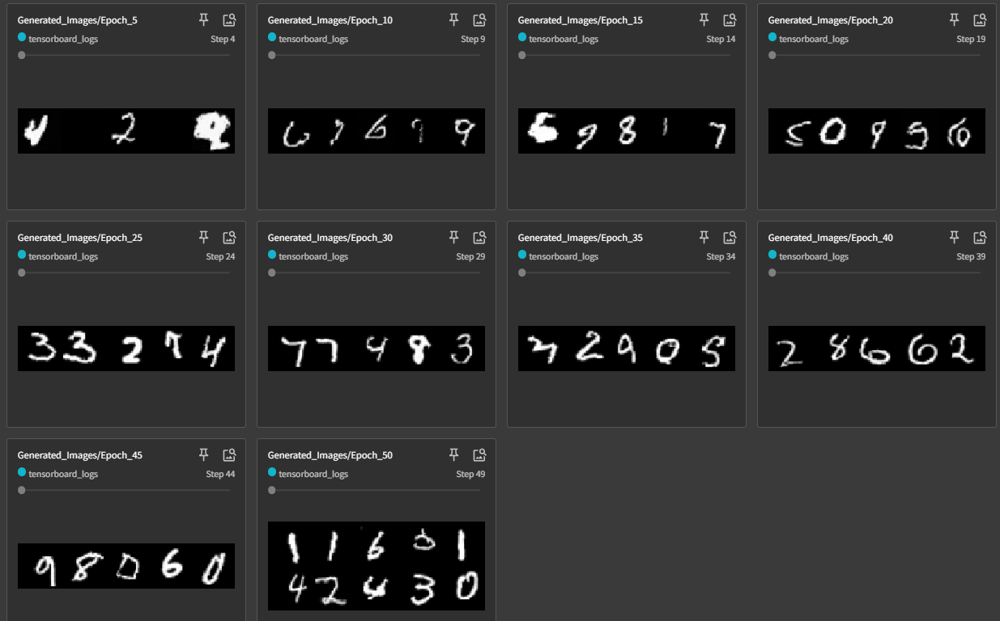
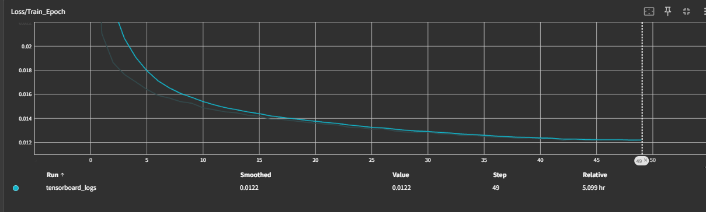
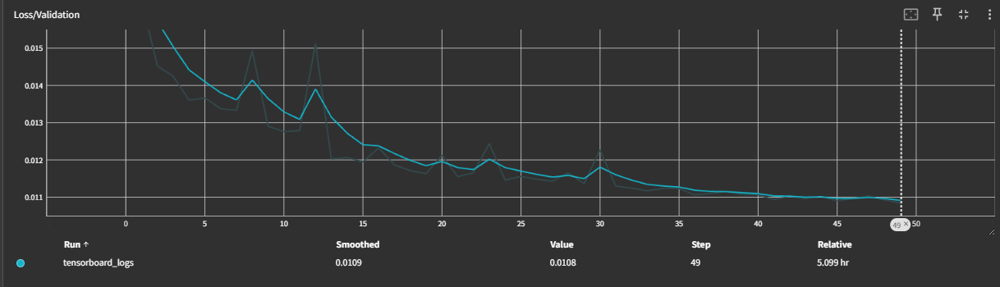

# Diffusion Model for MNIST

A PyTorch implementation of a Diffusion Model for generating MNIST digits using a UNet architecture with optional conditional generation.

## Features

- **Modern UNet Architecture**: Implements a state-of-the-art UNet with time embeddings, attention mechanisms, and residual blocks
- **EMA (Exponential Moving Average)**: Maintains shadow weights for better model stability
- **Comprehensive Logging**: TensorBoard integration with automatic sample generation
- **Flexible Configuration**: Easy-to-modify hyperparameters and model settings

## Requirements

```bash
torch>=1.9.0
torchvision>=0.10.0
numpy>=1.21.0
matplotlib>=3.3.0
tqdm>=4.62.0
tensorboard>=2.6.0
Pillow>=8.3.0
```

## Installation

1. Clone the repository:

```bash
git clone <repository-url>
cd diffusion
```

2. Install dependencies:

```bash
pip install torch torchvision numpy matplotlib tqdm tensorboard Pillow
```

3. Verify installation by running:

```bash
python train_eval.py --help
```

## Quick Start

### Basic Training (Unconditional Generation)

```bash
python train_eval.py
```

### Enable Conditional Generation

1. Open `train_eval.py`
2. Change `use_conditional_generation = False` to `use_conditional_generation = True`
3. Run training:

```bash
python train_eval.py
```

## 📁 Project Structure

```
diffusion/
├── README.md              # This file
├── train_eval.py          # Main training script
├── diffusion.py           # Diffusion model implementation
├── dataprocess.py         # MNIST data processing
├── unet.py               # UNet architecture
├── data/                 # MNIST dataset (auto-downloaded)
├── checkpoints/          # Model checkpoints and samples
│   ├── best_model.pt     # Best model weights
│   ├── samples/          # Generated samples during training
│   └── tensorboard_logs/ # TensorBoard logs
└── requirements.txt      # Dependencies (optional)
```

## Configuration

### Model Parameters

- **Image Size**: 32x32 (resized from MNIST's 28x28)
- **Channels**: 3 (RGB conversion from grayscale)
- **Diffusion Steps**: 1000
- **Base Channels**: 128
- **Architecture**: UNet with attention at resolutions 8x8 and 16x16

### Training Parameters

- **Batch Size**: 16
- **Epochs**: 50
- **Optimizer**: AdamW (lr=1e-4, weight_decay=1e-4)
- **Scheduler**: CosineAnnealingLR
- **EMA Decay**: 0.999

### Key Configuration Options (in `train_eval.py`):

```python
# Generation mode
use_conditional_generation = False  # Set to True for conditional generation
# Model architecture
image_size = 32                     # Image resolution
channels = 3                        # RGB channels
base_channels = 128                 # Base UNet channels
num_timesteps = 1000               # Diffusion steps
# Training settings
batch_size = 16                    # Batch size
epochs = 50                        # Training epochs
learning_rate = 1e-4              # Learning rate
```

## 🏃‍♂️ Usage Examples

### 1. Basic Training

```python
python train_eval.py
```

### 2. Monitor Training with TensorBoard

```bash
# Start TensorBoard (run in separate terminal)
tensorboard --logdir="logdir"
# Open browser to: http://localhost:6006
```

### 3. Custom Configuration

```python
# Modify these parameters in train_eval.py
epochs = 100                       # Train longer
batch_size = 32                    # Larger batch size
use_conditional_generation = True   # Enable conditional generation
```

### 3. output







\#:ARGS：

~~~python
device: cuda
batch_size: 16
epochs: 50
save_dir: /root/tf-logs
optimizer_type: AdamW
learning_rate: 0.0001
weight_decay: 0.0001
use_scheduler: True
scheduler_type: CosineAnnealingLR
total_params: 452364806
image_size: 32
channels: 3
num_timesteps: 1000
base_channels: 128
num_res_blocks: 2
channel_mult: (1, 2, 4, 8)
dropout: 0.1
time_emb_dim: 512
use_conditional_generation: False
num_classes: None
ema_decay: 0.999
ema_start: 5000
ema_update_rate: 1
train_size: 60000
test_size: 10000
use_augmentation: True
normalization: [-1, 1]
convert_to_rgb: True
~~~

## References

- [Denoising Diffusion Probabilistic Models (DDPM)](https://arxiv.org/abs/2006.11239)
- [Improved Denoising Diffusion Probabilistic Models](https://arxiv.org/abs/2102.09672)
- [DDPM](https://github.com/abarankab/DDPM/)
